# `runtrack3`
> IMPORTANT: This is a work in progress and subject to major changes before and/or after the specified **deadline**.

A fast-paced school project (a.k.a **`runtrack`**) on the basics of **JavaScript** which includes ~9 tasks/jobs per day, and must to be completed in one week. This is the _third time_ we've done this (Check out the [previous runtrack](https://github.com/abraham-ukachi/runtrack2)).

Finally!!! Some *`J - A - V - A - S - C - R - I - P - T`* ☕️ !!!! 😍
Words cannot describe how excited I am to begin these tasks / jobs.

**Let's Go!!!!** 🔥🔥🔥  


## Description
> Original text in French: Que la force soit avec toi...

May the force be with you #LOL


## Requirements

These are a couple of the main requirements for this school project:

1. Create a directory on github called **“runtrack3”**. In this directory, create a **“jour01”** directory, 
share it with **deepthoughtlaplateforme**. For each job, create a **“jobXX”** folder where XX is the job number. 
Don’t forget to send your changes as soon as a job is advanced or completed and include explicit comments in your commits.


## Days
> MOTTO: I'll always do [**more**](#More) 😜


| No. | Day | Status |
| --- | ---- | ------ |
| 1 | [*`Day 1 - Hello JS`*](#Day-1---Hello-JS) | **Paused** |
| 2 | [*`Day 2 - JS++`*](#Day-2---JS) | **Paused** |
| 3 | [*`Day 3 - jQuery`*](#Day-3---jQuery) | **Paused** |
| 4 | [*`Day 4 - Fetch`*](#Day-3---Fetch) | _*In progress*_ |
| 5 | [*`Day 5 - ?`*](#Day-3---) | TBD |

> NOTE: (\*) = still needs to be updated \
>       (TBD) = To Be Determined ;)


## Structure

The folder & file structure of this project:

- [**jour01**](./jour01/)
- - [**job01**](./jour01/job01/)
- - ...
- - [**job03**](./jour01/job03/)
- - * **index.php**
- - * **script.js**
- [**jour02**](./jour02/)
- ...
- [**screenshots**](./screenshots)
- LICENSE
- README.md

> NOTE: This is just a snippet.


<details id=1>
<summary><h2>Day 1 - Hello JS</h2></summary>

> The official deadline of the jobs below - according to [intra](https://intra.laplateforme.io) - was **17/01/2023 at 08:29 AM**.

Here is a list of all the task/job names, `.php` & `.js` files to be submitted and their corresponding / current **status** for this day:

| No. | Name | File(s) | Status |
|:----|:-----|:-----|:-------|
| 1 | *`Job 00`* | *N/A* | [Done](#) |
| 2 | *`Job 01`* | **job01/index.php** | [Done](./jour01/job01/index.php)  |
| 3 | *`Job 02`* | **job02/index.php**, **job02/script.js** | [Done](./jour01/job02/script.js) |
| 4 | *`Job 03`* | **job03/index.php**, **job03/script.js** | [Done](./jour01/job03/script.js) |
| 5 | *`Job 04`* | **job04/index.php**, **job04/script.js** | [Done](./jour01/job04/script.js) |
| 6 | *`Job 05`* | **job05/index.php**, **job05/script.js** | [Done](./jour01/job05/script.js) |
| 7 | *`Job 06`* | **job06/index.php**, **job06/script.js** | [Done](./jour01/job06/script.js) |
| 8 | *`Job 07`* | **job07/index.php**, **job07/script.js** | [Done](./jour01/job07/script.js)\* |
| 9 | *`Job 08`* | **job08/index.php**, **job08/script.js** | _*In progress*_ |
| 10 | *`Job 09`* | **job09/index.php**, **job09/script.js** | Pending |

> NOTE: (\*) = still needs to be updated \
> 			(*N/A*) = no file was required or needed for this particular task.

</details>


<details id=2>
<summary><h2>Day 2 - JS++</h2></summary>

> The official deadline of the jobs below - according to [intra](https://intra.laplateforme.io) - was **18/01/2023 at 11:24 AM**.

Here is a list of all the task/job names, `.php` & `.js` files to be submitted and their corresponding / current **status** for this day:

| No. | Name | File(s) | Status |
|:----|:-----|:-----|:-------|
| 1 | *`Job 00`* | *N/A* | [Done](#) |
| 2 | *`Job 01`* | **job01/index.php** | [Done](./jour02/job01/script.js) |
| 3 | *`Job 02`* | **job02/index.php**, **job02/script.js** | [Done](./jour02/job02/script.js) |
| 4 | *`Job 03`* | **job03/index.php**, **job03/script.js** | [Done](./jour02/job03/script.js) |
| 5 | *`Job 04`* | **job04/index.php**, **job04/script.js** | _*In progress*_ |
| 6 | *`Job 05`* | **job05/index.php**, **job05/script.js** | Pending |
| 7 | *`Job 06`* | **job06/index.php**, **job06/script.js** | Pending |

> NOTE: (\*) = still needs to be updated \
> 			(*N/A*) = no file was required or needed for this particular task.

</details> 


<details id=3>
<summary><h2>Day 3 - jQuery</h2></summary>

> The official deadline of the jobs below - according to [intra](https://intra.laplateforme.io) - was **19/01/2023 at 09:15 AM**

Here is a list of all the task/job names, `.php` & `.js` files to be submitted and their corresponding / current **status** for this day:

| No. | Name | File(s) | Status |
|:----|:-----|:-----|:-------|
| 1 | *`Job 00`* | *N/A* | [Done](#) |
| 2 | *`Job 01`* | **job01/index.php**, **job01/script.js** | [Done](./jour03/job01/script.js) |
| 3 | *`Job 02`* | **job02/index.php**, **job02/script.js** | [Done](./jour03/job02/script.js)\* |
| 4 | *`Job 03`* | **job03/index.php**, **job03/script.js** | _*In progress*_ |

> NOTE: (\*) = still needs to be updated \
> 			(*N/A*) = no file was required or needed for this particular task.

</details> 


<details id=4>
<summary><h2>Day 4 - Fetch</h2></summary>

> The official deadline of the jobs below - according to [intra](https://intra.laplateforme.io) - was **20/01/2023 at 11:33 AM**.

Here is a list of all the task/job names, `.php` & `.js` files to be submitted and their corresponding / current **status** for this day:

| No. | Name | File(s) | Status |
|:----|:-----|:-----|:-------|
| 1 | *`Job 00`* | *N/A* | [Done](#) |
| 2 | *`Job 01`* | **job01/index.php**, **job01/script.js** | _*In progress*_ |
| 3 | *`Job 02`* | **job02/index.php**, **job02/script.js** | Pending |
| 4 | *`Job 03`* | **job03/index.php**, **job03/script.js** | Pending |
| 4 | *`Job 04`* | **job03/index.php**, **job03/script.js** | Pending |

> NOTE: (\*) = still needs to be updated \
> 			(*N/A*) = no file was required or needed for this particular task.

</details> 


<details id=4>
<summary><h2>Day 5 - ?</h2></summary>

TBD

</details> 


---

## Installation
> IMPORTANT: Make sure you have `XAMPP` already installed in your Unix machine/ Mac before proceeding.

1. Clone this project's repository
```sh
git clone https://github.com/abraham-ukachi/runtrack3.git
```

> NOTE: There's no need to change the current working directory to **runtrack3**


2. Now, create a symbolic link of **runtrack3** in the `XAMPP`'s **htdocs** folder:

```sh
ln -s "runtrack3 /Applications/XAMPP/htdocs/runtrack3
```

3. Open the **runtrack3** folder in your default browser:

```sh
open http://localhost/runtrack3
```


---

## Testing

| Browser | Version | Status | Date | Time
|:--------|:--------|:-------|:-----|:-----
| *`Brave`* | **1.46.144** | Testing | 2023-01-19 | 10:51 AM
| *`Chrome`* | **-** | *Pending* | - | -
| *`Firefox`* | **-** | *Pending* | - | -
| *`Safari`* | **-** | *Pending* | - | -
| *`Opera`* | **-** | *Pending* | - | -
| *`Edge`* | **-** | *Pending* | - | -
| *`IE`* | **-** | *Pending* | - | -

> NOTE: *`IE`* = Internet Explorer = 👎🏽


## More 

These are some of the things I did in addition to this project's [job requirements](#Requirements):

1. ???? 

> NOTE:

---

## Some Random Screenshots
> NOTE: The following screenshots were captured with [inspector](https://www.chromium.org/developers/how-tos/inspecting-ash/) directly from the Chromium based **Brave Browser**:


### Day 01 - Screenshots

| GUI | Console |
|:----|:--------|
| 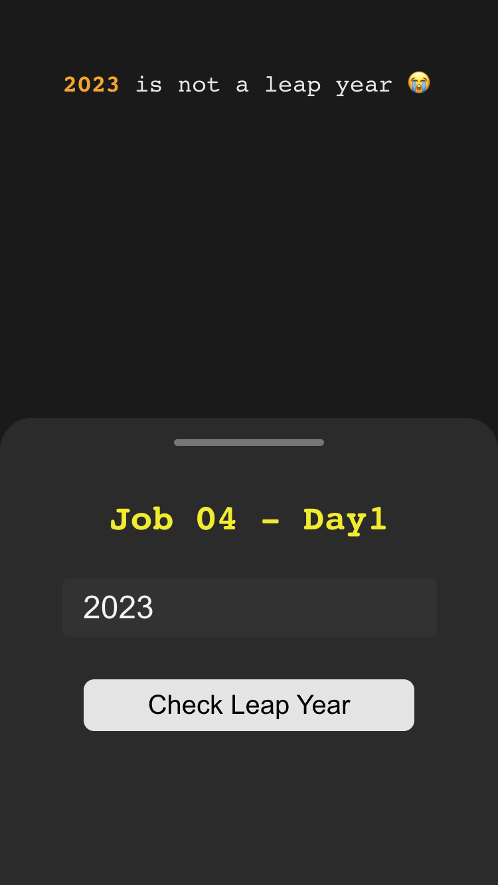 | 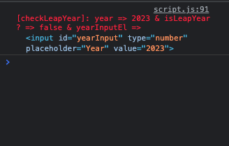
| 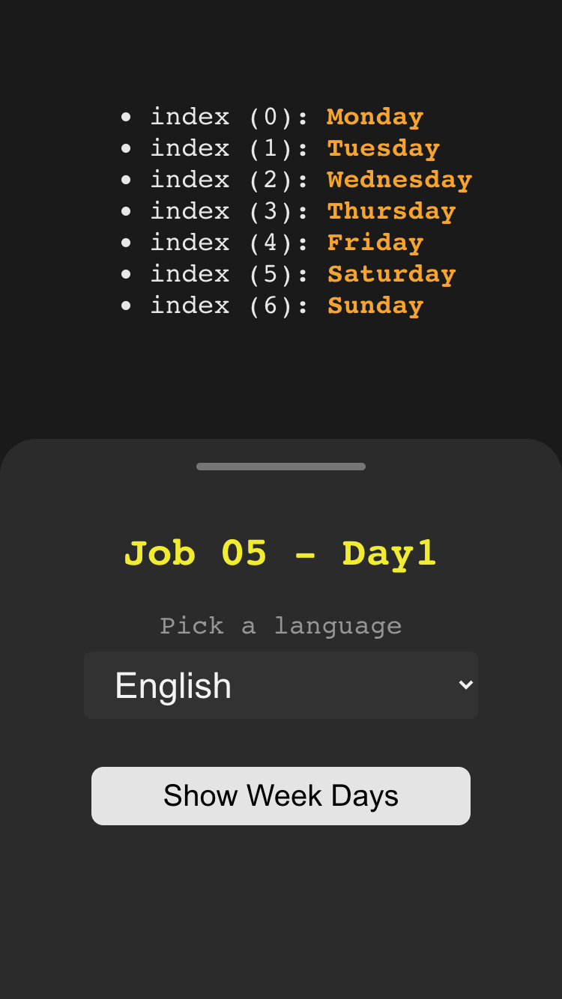 | 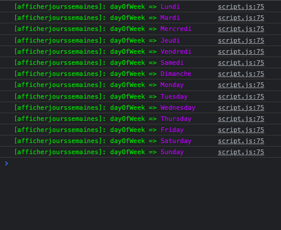
| 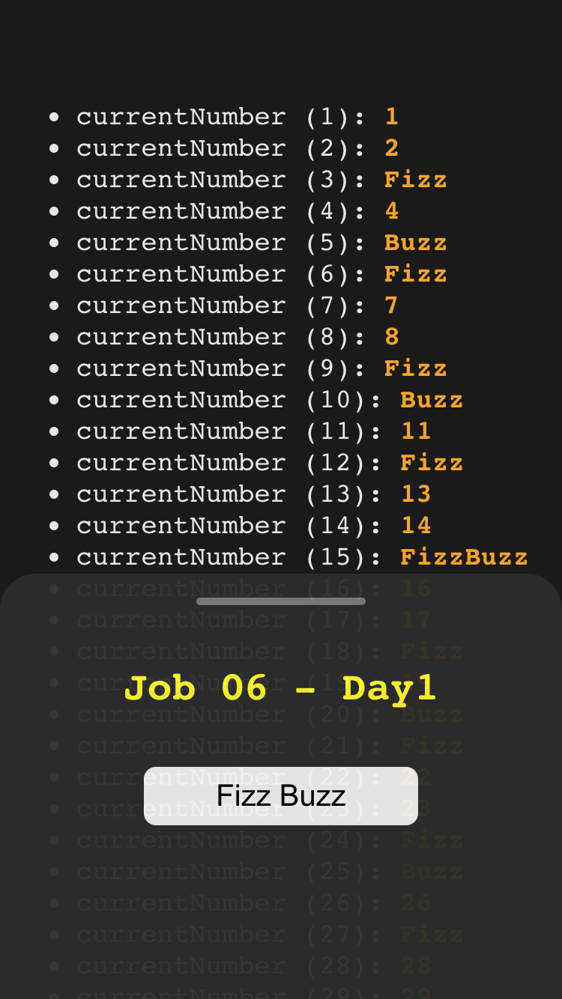 | 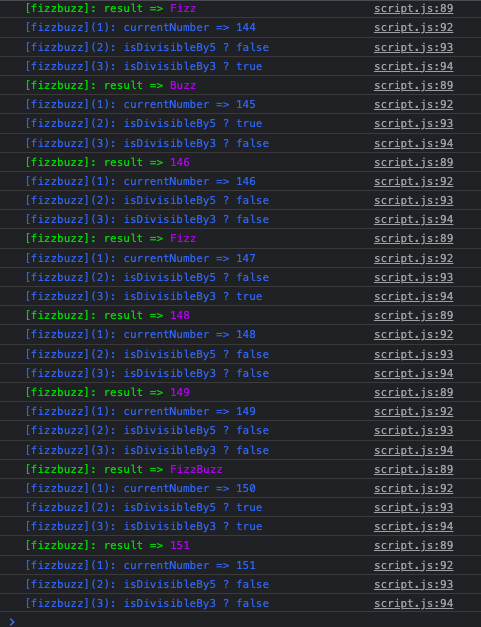
| 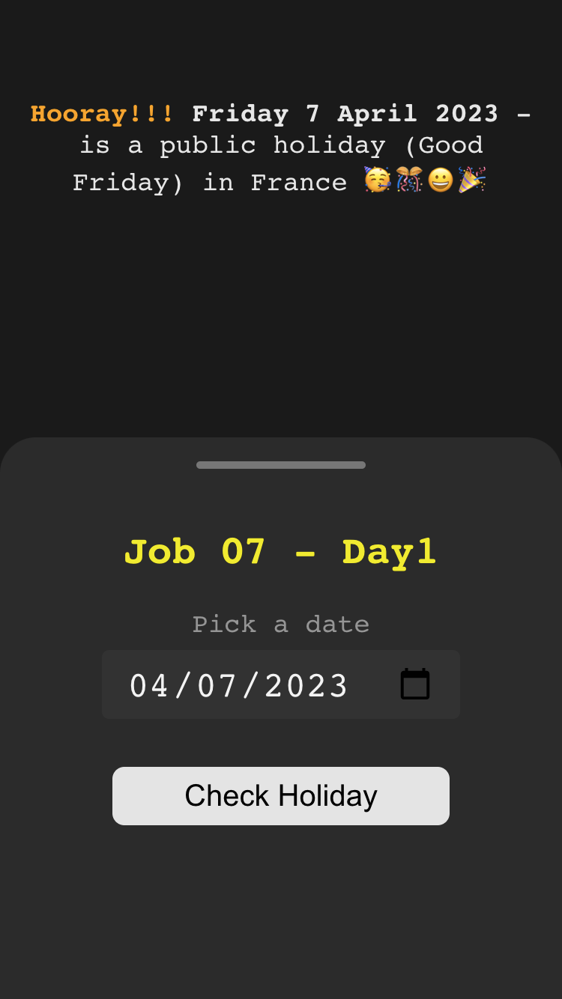 | 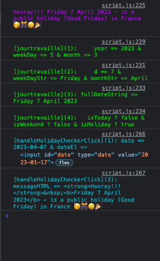


### Day 02 - Screenshots

| GUI | Console |
|:----|:--------|
| 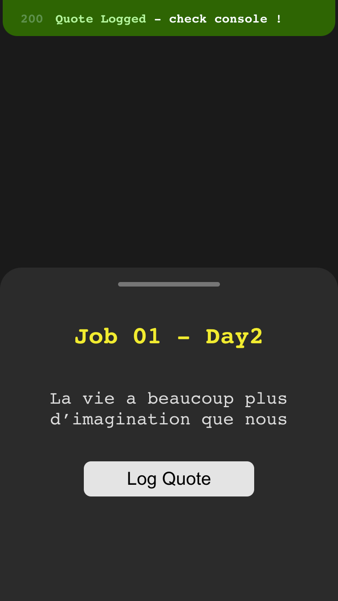 | 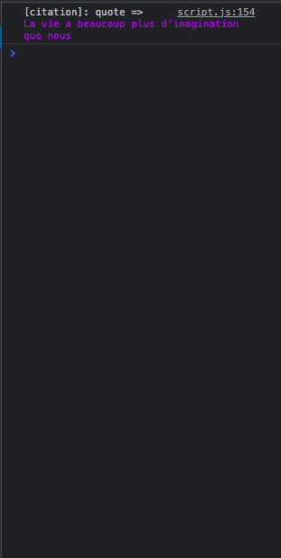
| 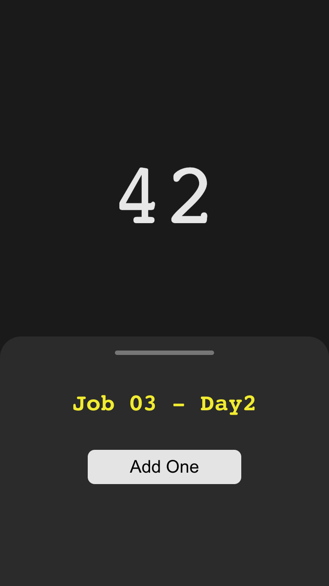 | 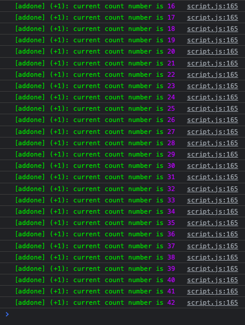


### Day 03 - Screenshots

| GUI | Console |
|:----|:--------|
| 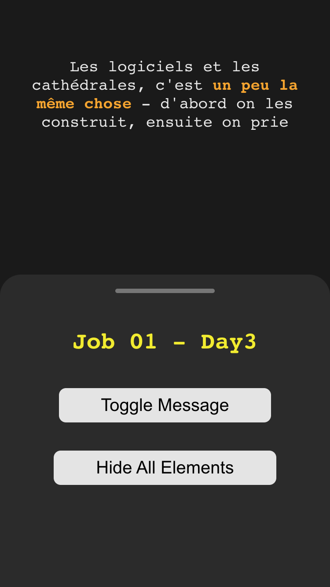 | 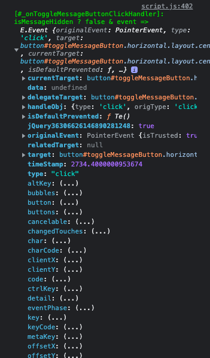

| GUI 1 | GUI 2 | Console 1 | Console 2 |
|:------|:------|:----------|:----------|
| 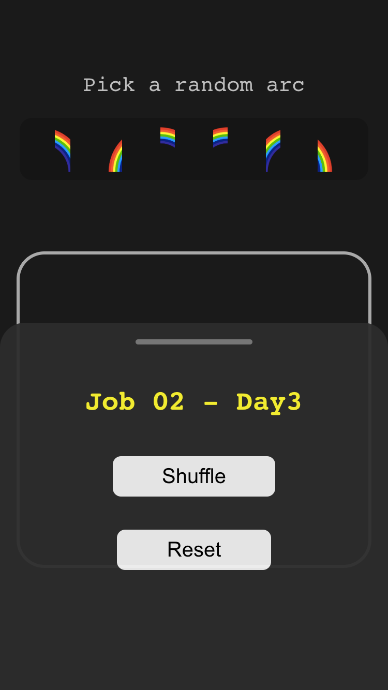 | 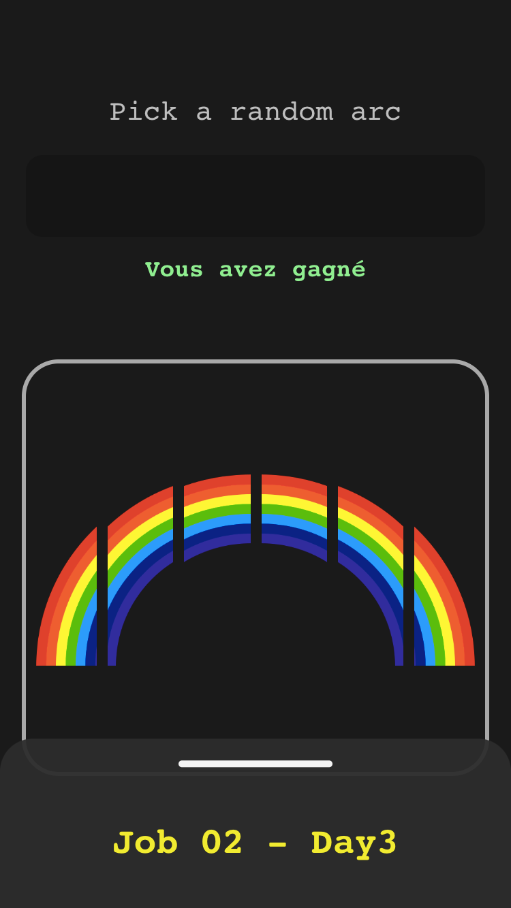 | N/A | 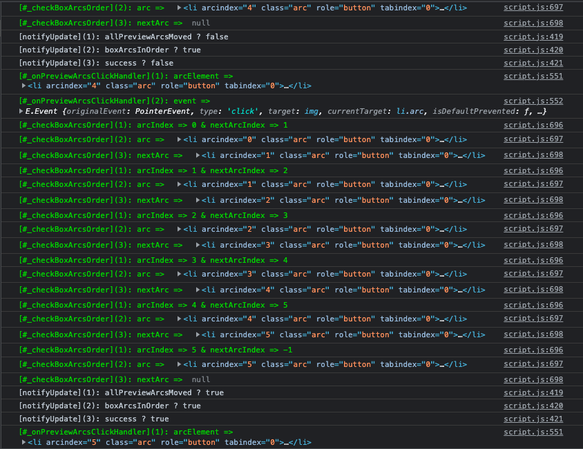|


### Day 04 - Screenshots

| GUI 1 | GUI 2 | Console 1 | Console 2 |
|:------|:------|:----------|:----------|
| N/A | N/A | N/A | N/A |


### Day 05 - Screenshots

| GUI | Console |
|:----|:--------|
| TBD | TBD |

---

## TODOs

- [x] Add screenshots
- [ ] Optimize all `.php` files
- [ ] Optimize all `.js` files
- [ ] Remove unnecessary comments

